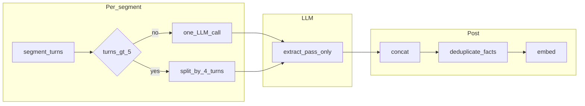

# Facts 构建：覆盖定义 + segment 内固定子块（无二次审查）

## 目标

1. **Fact 定义（短且不再靠补类型）**：**源文本中每个可核查片段都至少被一条 fact 覆盖**；可核查 = 非寒暄/填充/纯礼貌的低信息句；不要求、不提供 `fact_type` 等分类学。
2. **抗惰性（仅工程手段）**：长 segment 时 **固定 `chunk_size=4`（按 turn）** 拆成多段子块分别抽，**子块结果合并 + 去重**；**不增加**二次 LLM 审查 pass（成本过高）。
3. **Prompt**：只以 [fact_extraction.yaml](f:/AI/M-Agent/config/prompts/memory_build/fact_extraction.yaml) 里 **`fact_extraction_v4` 中文**为准改版；**保留**当前仍有效的「提取规则」结构（原子性、证据约束、时间、内容保留、过滤、`[Image:]` 等）；**输出 JSON** 仅保留必要字段（与用户已定稿方向一致：**不要** `evidence_sentence`、`fact_type`、`keywords` 等）。

## 代码：分块逻辑（替换旧逻辑）

**删除**（视为过时）：

- `build_facts_from_source_episode` 中 **「无 `segments` 时用 `fact_chunk_size` / `fact_chunk_overlap` 机械分块」** 整条分支。
- 随之可从配置与 `scan_and_form_scene_facts` / `load_from_episode` 传入链路上 **移除仅服务于该回退的 `fact_chunk_size`、`fact_chunk_overlap`**（若别处无引用）。

**新规则**（唯一子块化方式）：

- 仍以 `episodes_v1` 的 **segment** 为外层单位（`segment_turn_span` 对应 turns 列表）。
- 若该 segment 内 **turn 数 ≤ 5**：与现行为一致，**整段一次** `call_fact_extraction`。
- 若 **turn 数 > 5**：将该 segment 的 turns **按顺序切成每块最多 4 个 turn 的连续子块**（最后一块可不足 4），**每子块**各调用一次 `call_fact_extraction`，**证据仍归属同一 `segment_id`**（`complete_fact_item` 的 `segment_info` 用外层 segment），最后 **concat + `deduplicate_facts`**。

**跨子块指代（不必靠 overlap）**：

- 每次调用除 **`dialogue_block` = 当前子块 turn 文本**（事实抽取的主依据）外，**同时传入只读上下文**用于还原指代与时间锚点：
  - **优先**：当前 **整段 segment** 的完整对话文本（`turns_to_dialogue_block` 作用于该 segment 全部 turns）。
  - **可选增强**：若仍嫌语境不足，可再附 **整段 Episode** 的对话或现有 `build_episode_payload` 级 JSON（与现 v4「Episode context」一致），但须与 prompt 约束一致：**仅用于指代消解与相对时间解析，不得为仅出现在上下文、未出现在当前子块中的句子单独造 fact**。
- 实现上可在 `call_fact_extraction` 增加参数或在 `episode` / 占位符中区分「当前 Chunk」与「Segment/Episode 全文」两段输入；**v4 中文 prompt** 需把三条输入的语义写清（与现有 Start time + Chunk turns + Episode context 结构对齐，避免模型混淆证据来源）。

边界：

- **缺 segment** 的 episode：不再在 fact 阶段用机械分块兜底；应在 **episode 构建阶段保证有 segments**，或 fact 阶段 **记录 error / skip**（实现时二选一，优先与现有 episode 管线约定一致）。

涉及文件：[form_scene_details.py](f:/AI/M-Agent/src/m_agent/memory/build_memory/form_scene_details.py)、[load_from_episode.py](f:/AI/M-Agent/src/m_agent/memory/memory_core/workflow/build/load_from_episode.py)、[memory_system.py](f:/AI/M-Agent/src/m_agent/memory/memory_core/memory_system.py)、[mixins/config.py](f:/AI/M-Agent/src/m_agent/agents/memory_agent/mixins/config.py)、[locomo_eval_memory_core.yaml](f:/AI/M-Agent/config/memory/core/locomo_eval_memory_core.yaml) 等（按实际引用删参）。

## Prompt：`fact_extraction_v4` 中文

- **定义区**：用 **覆盖原则** 替换现有的 `fact_type` 四分类段落——即强调「**Chunk turns 内每个可核查片段至少对应一条 `atomic_fact`**；低信息句可整体不抽」。
- **输出格式**：与用户方向一致，例如 `event_log.time` + `event_log.atomic_fact` 为 **字符串数组** 或 **仅含 `atomic_fact` 键的对象数组**（与当前 zh 片段对齐）；**不输出** `evidence_sentence`、`fact_type`、`keywords`。
- **提取规则 1–7**：**保留**现有条理（原子性、证据约束、时间、归因、`[Image:]`、过滤等）；逐条检查 **删改仍引用 `evidence_sentence` / `keywords` 的句子**（例如规则 2、4 里若要求写入 keywords，改为写入 `atomic_fact` 正文中的检索锚点即可）。
- **子块模式**：在规则中明确 **Segment/Episode 全文仅作指代与时间上下文**；**可核查片段的覆盖范围仍仅针对当前 Chunk turns**（避免模型把上下文里的信息误抽成无子块证据的 fact）。

## Prompt：英文 v4

- **`prompt_language: en`** 时不应因 schema 不一致导致 `normalize_fact_items` 失败；将 **en** 的 schema 与覆盖定义与 **zh** 对齐（同一套字段）。

## 解析与后处理

- [normalize_fact_items](f:/AI/M-Agent/src/m_agent/memory/build_memory/form_scene_details.py) / [complete_fact_item](f:/AI/M-Agent/src/m_agent/memory/build_memory/form_scene_details.py)：在模型不再返回 `evidence_sentence` 时，**兼容**：例如置空、`evidence_sentence` 沿用 `atomic_fact`、或仅从子块 turn 范围推导——需满足 `deduplicate_facts` 与 [details_search](f:/AI/M-Agent/src/m_agent/memory/memory_core/workflow/search/details_search.py) 对可选字段的兼容（稀疏文本主要吃 `Atomic fact` 亦可）。

## 明确不做

- **二次审查 / coverage audit** LLM pass：**不实现**（已从计划中移除）。

## 观测与测试（轻量）

- 日志：segment turn 数、子块数、每段 fact 条数（便于调 `4` 与阈值 `5`）。
- 可选：对 conv-30 若干金句做关键字级回归（与先前 facts 缺口对照）。

## 风险与说明

- **调用量**：仅长 segment（>5 turns）按子块增加调用次数；无第二 pass。
- **子块边界与指代**：通过 **每次调用附带整段 segment（及必要时整段 Episode）只读上下文** 做指代消解与时间补全，**不依赖**子块 overlap；若 prompt/实现未把「仅 chunk 可抽 fact」写牢，可能产生无子块证据的幻觉 fact，需在规则与后处理中约束。
- **无 segment 数据**：必须 upstream 保证 episodes 有 segments，否则本方案不再静默机械分块。
