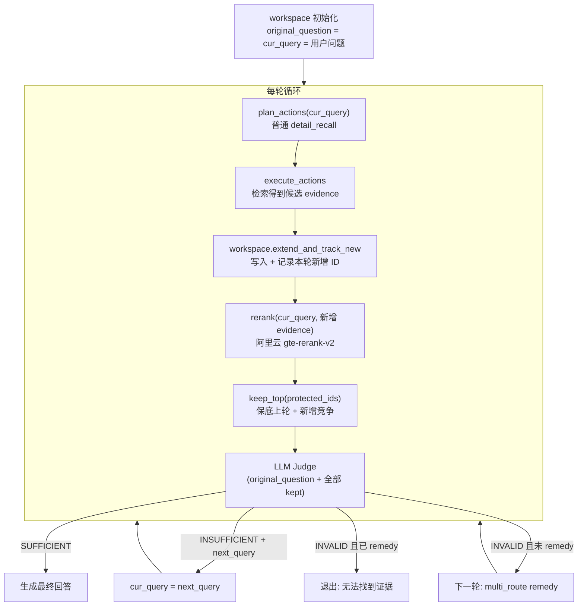

# 两层筛选 + 任务驱动多轮检索：完整实施计划

## 架构总览



## 核心设计原则

- **plan_actions 和 rerank 用 `cur_query`** — 每轮检索目标可能不同
- **LLM judge 始终面向 `original_question`** — 判断能否回答用户原始问题
- **keep_top 不排除上轮 judge 认可的证据** — 保底 + 新增竞争
- **multi_route 只在 INVALID 时触发一次** — 平时不用，最后一搏

---

## Part A：Evidence 结构化文档 [已完成]

### A1. EpisodeEvidence 扩展

**文件**: [workspace.py](src/m_agent/agents/memory_agent/workspace.py) 第 10-23 行

`EpisodeEvidence` TypedDict 新增三个字段：
- `event_time: Dict[str, str]` — 记录时间 (start_time / end_time)
- `event_info: Dict[str, Any]` — 场景信息 (scene_id, scene_theme)
- `participants: List[str]` — 参与者列表

### A2. action_executor 提取新字段

**文件**: [action_executor.py](src/m_agent/agents/memory_agent/action_executor.py)

在构建 evidence 时从 `content_search` 结果中提取 `event_time`（含 `turn_time_span` fallback）、`event_info`、`participants`。

### A3. format_evidence_block 结构化输出

**文件**: [workspace.py](src/m_agent/agents/memory_agent/workspace.py) 第 250-299 行

`to_evidence_summary()` 改为调用 `format_evidence_block()`，每条 evidence 生成如下格式：

```
=== Evidence [1]  ref: dlg1:ep1 ===
【记录时间】2023-01-20T16:04:00 ~ 2023-01-20T16:06:15
【场景主题】Jon's job loss and dance studio plans
【参与者】Jon, Gina
【相关事实】
  - Jon lost his banking job
【对话内容】
  Jon: I lost my banking job last week.
  Gina: Oh no, what happened?
```

### A4. upsert 合并新字段

**文件**: [workspace.py](src/m_agent/agents/memory_agent/workspace.py) 第 84-121 行

`upsert()` 中初始化和合并 `event_time`、`event_info`、`participants`。

---

## Part B：阿里云 Rerank [已完成]

### B1. Rerank API 模块

**新文件**: [AlibabaRerankCall.py](src/m_agent/load_model/AlibabaRerankCall.py)

- 复用 `ALIBABA_API_KEY`
- 优先 dashscope SDK，fallback HTTP 调用
- 返回 `[{"index": int, "relevance_score": float}, ...]`
- 默认模型 `gte-rerank-v2`

### B2. 配置读取和初始化

**文件**: [core.py](src/m_agent/agents/memory_agent/core.py) 第 148-164 行

从 `workspace.rerank` 配置块读取 enable/provider/model_name/score_threshold/max_documents，创建 `self.rerank_func`。

### B3. Agent YAML 配置

**文件**: [locomo_eval_memory_agent.yaml](config/agents/memory/locomo_eval_memory_agent.yaml) 第 31-36 行

```yaml
workspace:
  rerank:
    enable: true
    provider: "aliyun"
    model_name: "gte-rerank-v2"
    score_threshold: 0.2
    max_documents: 16
```

---

## Part C：Workspace 任务驱动 [已完成]

### C1. Workspace 新增字段

**文件**: [workspace.py](src/m_agent/agents/memory_agent/workspace.py) 第 57-67 行

- `original_question: str` — 用户原始问题，不变
- `cur_query: str` — 当前检索任务，由 judge 更新

### C2. 新增辅助方法

**文件**: [workspace.py](src/m_agent/agents/memory_agent/workspace.py) 第 170-179 行

- `extend_and_track_new()` — extend 后返回本轮新增的 evidence_id 列表
- `set_rerank_score()` — 单独写入 rerank 分数

### C3. WorkspaceState / snapshot 包含新字段

`WorkspaceState` TypedDict 和 `snapshot()` 都包含 `original_question` 和 `cur_query`。

---

## Part D：LLM Judge [已完成]

### D1. answerability.py 重写

**文件**: [answerability.py](src/m_agent/agents/memory_agent/answerability.py)

- `quick_reject()` — 零 LLM 调用快速排除（workspace 空 / evidence 全空）
- `llm_judge_workspace()` — LLM 精判，返回 `JudgeDecision`：
  - `status`: SUFFICIENT / INSUFFICIENT / INVALID
  - `useful_evidence_ids`: judge 选出的有用证据
  - `next_query`: INSUFFICIENT 时的下一轮检索 query
  - `reason` + `gap_type`
- 安全校验：LLM 说 INVALID 但选了新证据为有用 → 升级为 INSUFFICIENT

### D2. workspace_judge_prompt

**文件**: [agent_runtime_facts_only.yaml](config/agents/memory/runtime/agent_runtime_facts_only.yaml) 第 182-231 行
**文件**: [agent_runtime.yaml](config/agents/memory/runtime/agent_runtime.yaml) 对应位置

输入：original_question + cur_query + workspace_evidence_summary + new_evidence_ids
输出：JSON `{status, useful_evidence_ids, reason, next_query}`

---

## Part E：主循环已集成 Rerank + Judge [已完成]

**文件**: [execution.py](src/m_agent/agents/memory_agent/mixins/execution.py) 第 483-652 行

当前每轮流程：
1. `plan_actions(cur_query)` — 用 cur_query
2. `execute_actions` → report
3. `workspace.extend_and_track_new(report.evidences)` → new_evidence_ids
4. `_rerank_new_evidences(workspace, cur_query, new_evidence_ids)` — 只 rerank 新增
5. `workspace.keep_top(...)` — **目前有问题，见 Part F**
6. `_run_llm_judge(workspace, new_evidence_ids)` → decision
7. 更新 `kept_evidence_ids` 和 `cur_query`

---

## Part F：keep_top 保底模式 [待修复]

**问题**: 当前 `keep_top()` 每次对全部 evidence 按分数重排取 top-K，会把上一轮 judge 已认可的证据挤掉。

**文件**: [workspace.py](src/m_agent/agents/memory_agent/workspace.py) 第 131-146 行

**改法**: `keep_top` 新增 `protected_ids` 参数：

```python
def keep_top(self, max_keep=None, protected_ids=None):
    limit = self.max_keep if max_keep is None else max(1, int(max_keep))
    protected = set(protected_ids or [])
    kept = [eid for eid in self._insert_order
            if eid in protected and eid in self._evidences]
    remaining_slots = limit - len(kept)
    if remaining_slots > 0:
        candidates = []
        for index, eid in enumerate(self._insert_order):
            if eid in protected or eid not in self._evidences:
                continue
            ev = self._evidences[eid]
            score = ev.get("rerank_score")
            if score is None:
                score = ev.get("recall_score")
            if score is None:
                score = 0.0
            candidates.append((eid, float(score), -index))
        candidates.sort(key=lambda x: (x[1], x[2]), reverse=True)
        kept.extend(eid for eid, _, _ in candidates[:remaining_slots])
    self.kept_evidence_ids = kept
    return list(self.kept_evidence_ids)
```

**文件**: [execution.py](src/m_agent/agents/memory_agent/mixins/execution.py) 第 589 行

调用处传入 protected_ids：

```python
workspace.keep_top(
    max(1, int(getattr(self, "workspace_max_keep", 6))),
    protected_ids=workspace.kept_evidence_ids,
)
```

---

## Part G：multi_route 仅 INVALID 触发一次 [待修复]

**问题**: 当前 `plan_actions` 中 `enable_multi_route and round > 1` 会让后续轮次自动升级为 multi_route。应改为平时只用普通 recall，INVALID 时用一次 multi_route，再 INVALID 直接退出。

### G1. plan_actions 去掉自动升级

**文件**: [action_planner.py](src/m_agent/agents/memory_agent/action_planner.py) 第 123-149 行

将 for 循环改为：

```python
for idx, sub_question in enumerate(sub_questions):
    q = str(sub_question or "").strip() or question
    if not q:
        continue
    if force_remedy:
        _push(
            ACTION_RECALL_REMEDY_MULTI_ROUTE,
            {"detail_query": q, "topk": safe_topk},
            source_sub_idx=idx,
            priority=100,
        )
        continue
    _push(
        ACTION_EVENT_DETAIL_RECALL,
        {"detail_query": q, "topk": safe_topk},
        source_sub_idx=idx,
        priority=10,
    )
```

可选：从 `plan_actions` 签名中移除 `enable_multi_route` 参数（或保留但不使用）。

### G2. 主循环退出条件

**文件**: [execution.py](src/m_agent/agents/memory_agent/mixins/execution.py) 约第 622-625 行

在循环末尾增加 INVALID + 已 remedy → 直接退出：

```python
if decision["status"] == "SUFFICIENT":
    break
if decision["status"] == "INVALID" and remedy_used >= remedy_limit:
    break
if round_id >= max(1, int(max_rounds)):
    break
```

### G3. 可选清理

- [execution.py](src/m_agent/agents/memory_agent/mixins/execution.py) 第 506 行：删除 `enable_multi_route` 变量读取
- [execution.py](src/m_agent/agents/memory_agent/mixins/execution.py) 第 536 行：删除传给 `plan_actions` 的 `enable_multi_route=` 参数
- [core.py](src/m_agent/agents/memory_agent/core.py) 第 141-146 行：删除 `self.enable_detail_search_multi_route` 读取
- [locomo_eval_memory_agent.yaml](config/agents/memory/locomo_eval_memory_agent.yaml) 第 30 行：删除 `enable_detail_search_multi_route: true`

---

## 验证

```bash
python -m pytest tests/test_memory_action_executor.py tests/test_memory_agent_tool_calls_payload.py -v
```

然后用 webui 或 eval 脚本跑一个问题端到端验证。
