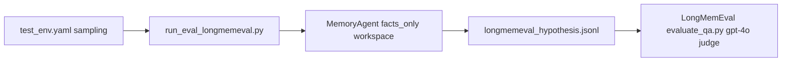

# LongMemEval 评测结果初步分析与后续分析计划

## 一、现有结果摘要（来自终端与 `[log/longmemeval_run_test1/longmemeval_hypothesis.jsonl](log/longmemeval_run_test1/longmemeval_hypothesis.jsonl)`）

| 题型                            | question_id      | 裁判结果     | 现象（hypothesis vs oracle）                                        |                                                                                         |
| ----------------------------- | ---------------- | -------- | --------------------------------------------------------------- | --------------------------------------------------------------------------------------- |
| knowledge-update              | `28bcfaac`       | 通过       | 与参考答案一致（MusicTheory.net）                                        |                                                                                         |
| single-session-user           | `4d6b87c8`       | 通过       | 数值一致（25）                                                        |                                                                                         |
| **single-session-preference** | `caf03d32`       | **未通过**  | 长段「证据不足、仅涉及酸奶」类拒答，而 oracle 为**对用户偏好的总结性陈述**（slow cooker 场景下的偏好） | I've been struggling with my slow cooker recipes. Any advice on getting better results? |
| single-session-assistant      | `d52b4f67`       | 通过       | 地点表述略异但裁判判真（Grand Ballroom）                                     |                                                                                         |
| **temporal-reasoning**        | `gpt4_d6585ce9` | **未通过** | 同伴答成「Your sister」，oracle 为「my parents」                          | Who did I go with to the music event last Saturday?                                     |
| **multi-session**             | `gpt4_d84a3211`  | **未通过**  | 长段「无法从全年维度汇总」，oracle 为**具体金额**（$185）                            | How much total money have I spent on bike-related expenses since the start of the year? |

**总体**：`Accuracy: 0.5`；失败集中在 **偏好归纳**、**跨会话/时间推理与人物关系**、**多段金额聚合** 三类，与 `[config/eval/memory_agent/longmemeval/test_env.yaml](config/eval/memory_agent/longmemeval/test_env.yaml)` 中 `per_question_type: 1` 的抽样设计一致（每类 1 题，故每类分数只有 0 或 1）。

**评测链路**（便于后续分析时对照）：

---

## 二、与项目机制的初步对齐（非最终结论，供深挖验证）

1. **Hypothesis 内容从哪来**
  `[scripts/run_longmemeval/run_eval_longmemeval.py](scripts/run_longmemeval/run_eval_longmemeval.py)` 中 `_hypothesis_from_result`：**优先 `gold_answer`，否则退回整段 `answer`**。  
   两条失败记录的长 hypothesis 很可能对应 `**gold_answer` 为空/`null` 时整段解释进了 `answer**`，被原样写入 jsonl 交给上游裁判；这会使裁判在「语义匹配 oracle」上更吃亏，且与「偏好 / 聚合」类题型的期望输出形态不一致。
2. **系统设定偏向「严格可证事实」**
  - MemoryCore：`[config/memory/core/longmemeval_eval_memory_core.yaml](config/memory/core/longmemeval_eval_memory_core.yaml)` 中 `facts_only_mode: true`。  
  - Runtime：`[config/agents/memory/longmemeval_eval_memory_agent.yaml](config/agents/memory/longmemeval_eval_memory_agent.yaml)` 使用 `agent_runtime_facts_only.yaml`；其中 `[final_answer_from_workspace_prompt](config/agents/memory/runtime/agent_runtime_facts_only.yaml)` 明确「证据明显不足则 `gold_answer` 为 null」。  
   **与 single-session-preference 的冲突点**：oracle 往往是**从对话归纳的用户偏好**，若工作区里只有片段事实、或 judge/规划器把「广义建议」与「可证片段」对立起来，容易走向**拒答**，而非常见 LoCoMo 式 F1；LongMemEval 官方裁判则更看与 gold 的语义一致。
3. **temporal-reasoning 错 companion**
  更可能是 **检索到的 episode/片段错误、实体消歧失败、或证据合并时张冠李戴**，而非单纯「模型不会算时间」。需在日志里核对：最终工作区里是否同时出现 sister / parents 相关句，以及 rerank 阈值 `[workspace.rerank.score_threshold: 0.1](config/agents/memory/longmemeval_eval_memory_agent.yaml)` 是否引入噪声。
4. **multi-session 金额**
  模型在 hypothesis 中自述「只看到两笔 $25+$40」，与 oracle **$185** 差距大，说明要么 **记忆构建/导入未覆盖含其余消费的对话**，要么 **检索未召回到其他月份/会话**，要么 **题目要求「年初至今」而 agent 过度保守**（未在部分证据下做可辩护的求和）。需用数据与 trace 区分「召回缺口」与「回答策略过严」。

---

## 三、详细分析计划（建议按顺序执行）

### 阶段 A：结果与数据对齐（1–2 小时）

- **A1. 固定样本清单**：以当前 6 个 `question_id` 为基准，在 `[data/LongMemEval/data/longmemeval_s_cleaned.json](data/LongMemEval/data/longmemeval_s_cleaned.json)`（或你实际使用的 data.file）中抽出完整记录：`question`、`question_type`、官方 `answer`、若有则 `haystack_sessions` / 相关 metadata。  
- **A2. Oracle 对齐**：在 `[data/LongMemEval/data/longmemeval_oracle.json](data/LongMemEval/data/longmemeval_oracle.json)` 中核对同 id 的参考答案与评测脚本期望字段（与上游 `evaluate_qa.py` 一致）。  
- **A3. 记忆资产核对**：对每个 id，列出 `[data/memory/longmemeval/...](data/memory/longmemeval)` 下已导入的 dialogue / episode / fact 文件范围，确认 **import + warmup 是否覆盖该题所需的全部 haystack**（尤其 multi-session 与 temporal）。

### 阶段 B：行为与 Trace 深挖（核心，2–4 小时）

- **B1. 单次 `agent.ask` 全链路日志**：定位 MemoryAgent 在 eval 时写日志的位置（如 `log/<test_id>/` 下是否有 thread、workspace、tool 调用记录）；对三道错题各拉一份 **最终轮工作区证据列表** 与 **每轮 `cur_query` / `next_query`**。  
- **B2. 工作区状态机**：对照 `[agent_runtime_facts_only.yaml](config/agents/memory/runtime/agent_runtime_facts_only.yaml)` 里 `workspace_judge_prompt` 的 SUFFICIENT/INSUFFICIENT/INVALID 判定，看错题是否在早期被标为 INSUFFICIENT 后 **未再召回到关键片段**，或 **max_rounds: 3**（`[longmemeval_eval_memory_agent.yaml](config/agents/memory/longmemeval_eval_memory_agent.yaml)`）过早结束。  
- **B3. 最终 JSON 解析**：从对应 run 的原始模型输出中确认 `**gold_answer` 与 `answer` 的实际填充**（验证「拒答长文来自 answer 回退」的假设），并评估是否需要在导出层或 prompt 层约束「提交给官方评测的一行文本」形态。

### 阶段 C：题型专项假设检验

- **C1. single-session-preference**：对比「工作区是否包含用户明确表达的偏好句」与「最终是否仍选 null」；若证据实际足够，则问题在 **final_answer 或 facts_only 策略**；若证据不足，则问题在 **检索 / 记忆写入（偏好类 fact 是否被抽取）**。  
- **C2. temporal-reasoning**：在工作区中全文搜索 `parents` / `sister` / `Saturday` 等锚点，判断是 **证据错** 还是 **生成错**（有 parents 仍答 sister → 生成；无 parents → 召回/记忆）。  
- **C3. multi-session**：枚举所有含「bike」「」的已索引片段，手工加总是否与 **185** 一致；若数据中有而工作区无 → **召回/路由**；若数据中无 → **数据或 import 路径**问题。

### 阶段 D：裁判与指标（辅助，0.5–1 小时）

- **D1**：阅读上游仓库 `[data/LongMemEval/src/evaluation/evaluate_qa.py](data/LongMemEval/src/evaluation/evaluate_qa.py)`（若本地可读）中 **autoeval_label** 的判定提示，明确裁判是偏「字面包含」还是「语义等价」，避免后续调 prompt 时与裁判偏好打架。  
- **D2**：保留本次 `[log/longmemeval_run_test1/longmemeval_hypothesis.jsonl.eval-results-gpt-4o](log/longmemeval_run_test1/longmemeval_hypothesis.jsonl.eval-results-gpt-4o)`（若已生成）作为 baseline，后续每次只改一个变量便于对比。

### 阶段 E：改进方向清单（在 B/C 结论后再定优先级）

- **E1 记忆与召回**：调整 `workspace`（`max_rounds`、`max_keep`、rerank 阈值）、或 MemoryCore 的 `detail_search`_* / `memory_top_k`；对偏好题考虑 **ENTITY_FEATURE_SEARCH** 是否在 action planner 中被稳定选中（`[agent_runtime_facts_only.yaml](config/agents/memory/runtime/agent_runtime_facts_only.yaml)` 已提示该工具）。  
- **E2 回答策略**：在 **不破坏 facts_only 红线** 的前提下，区分「无证据」与「可基于用户陈述归纳偏好」；必要时为 LongMemEval eval **单独**准备一版 runtime prompt（与通用生产配置隔离）。  
- **E3 导出层**：评估是否在 `gold_answer` 为空时，对官方 jsonl **改用短句占位**或结构化字段（需与上游 `evaluate_qa.py` 输入契约对齐后再改 `[run_eval_longmemeval.py](scripts/run_longmemeval/run_eval_longmemeval.py)`）。

---

## 四、交付物建议

- 一份 **错题三维表**（题型 × 证据是否含答案 × 根因大类：记忆/检索/生成/导出/裁判）。  
- 每个失败 `question_id` 各 **1 页以内的 trace 摘要**（最终 kept 证据条数、关键句引用、为何判拒或错实体）。  
- 明确下一版实验的 **单一变量** 列表（例如先只放宽 preference 的 final prompt，或只调 multi-route 召回，避免混改）。

---

## 五、风险与范围说明

- 当前样本 **每题型仅 1 题**，分项准确率波动大；结论应标为「假设 + 待验证」，扩大 `per_question_type` 或固定多 seed 后再谈稳定性。  
- `[official_eval.yaml](config/eval/memory_agent/longmemeval/official_eval.yaml)` 含密钥，分析文档与分享时注意脱敏（勿将 key 贴入 issue/日志）。

