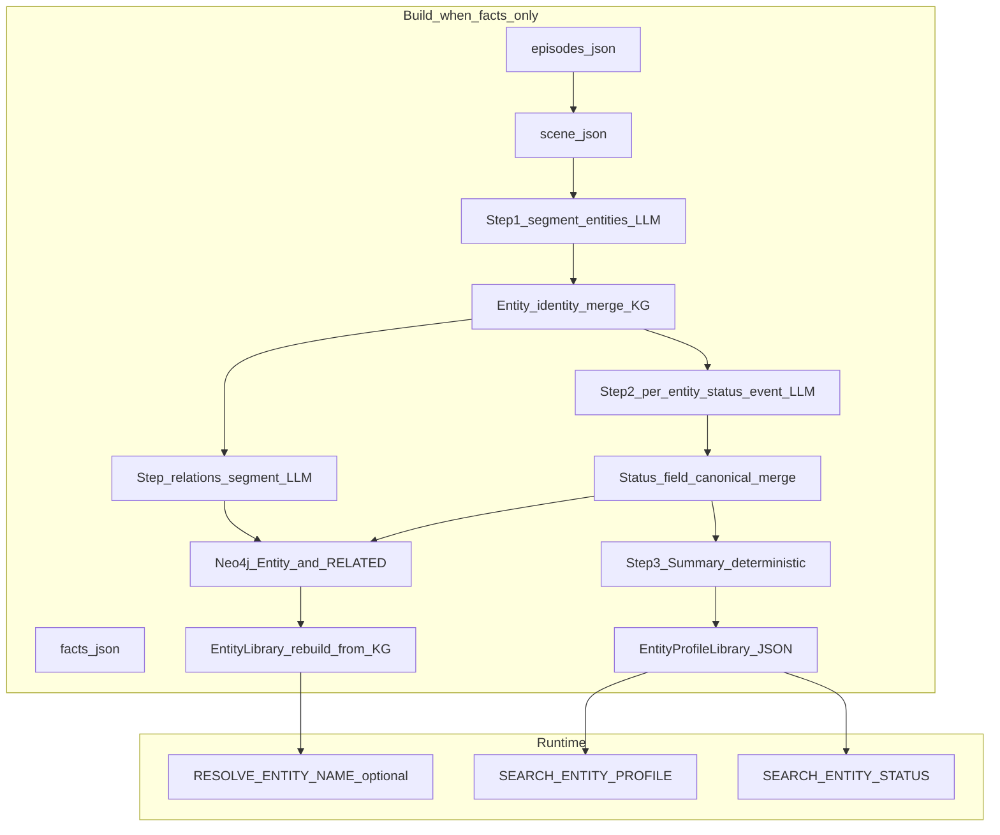

# facts_only_mode 之后实体档案：生成与使用实现方案

## 背景与缺口

- 当前 `[load_from_episode.py](src/m_agent/memory/memory_core/workflow/build/load_from_episode.py)` 在 `facts_only_mode=true` 时 **跳过** `extract_fact_entities` / `import_fact_entities`，因此 **不会** 走基于 fact 的 KG 写入与后续 `entity_profile_align`；文件末尾的 `resolution_note` 也写明当前模式 **0 实体/关系**。
- 现有 `[EntityProfileService](src/m_agent/memory/memory_core/services_bank/entity_profile_sys/service.py)` / `[EntityProfileLibrary](src/m_agent/memory/memory_core/services_bank/entity_profile_sys/library.py)` 以 **fact 文件** 为输入做 `align_with_master_facts`；`EntityProfileRecord` 是简化版（`attributes` / `events` / `summary`），与 [docs/Entity.yaml](docs/Entity.yaml) 的 **Statuses / Other names / Relations / 嵌套 embedding 元数据** 不完全一致。
- Neo4j 侧 `[KGBase](src/m_agent/memory/memory_core/core/kg_base.py)` 已有 `:Entity`（`id`, `uid`, `name`, `type`, `features_json`, `attributes_json`, …）与 `[:RELATED]`，适合作为 **跨 segment 稳定实体** 与 **关系边** 的权威存储；向量检索仍以现有 `embed_func` 在应用层计算为主（与当前 `query_entity_feature` 一致），避免强依赖 Neo4j 向量索引版本。
- `[tooling.py](src/m_agent/agents/memory_agent/mixins/tooling.py)` 在 `facts_only_mode` 下 **仅保留** `search_content` / `search_events_by_time_range` / `search_details`，实体类工具被整体关闭——与 Entity.yaml 中希望在问答链使用档案/状态的能力存在张力，需要在 **不破坏 facts-only 证据契约** 的前提下重新开放。

---

## 1. 数据模型：Entity.yaml 与代码/图存储的映射

**建议采用「Neo4j 权威图 + 本地派生索引」双写**，与现有 README 中「EntityLibrary 非权威、可从 KG 重建」的约定一致（见 `[core/README.md](src/m_agent/memory/memory_core/core/README.md)`）。

| Entity.yaml 概念         | Neo4j / 图                                                                                                                         | 本地 `EntityProfileLibrary` / 解析                                                                                                 |
| ---------------------- | --------------------------------------------------------------------------------------------------------------------------------- | ------------------------------------------------------------------------------------------------------------------------------ |
| `entity_UID`           | `Entity.uid`（稳定主键）；`Entity.id` 继续用作兼容主键（可与 uid 对齐或 `ent_`* 短 id）                                                                  | `EntityRecord` + 解析索引                                                                                                          |
| `name` + `Other names` | `Entity.name` 存规范名；**Other names 不在 Step1 由 LLM 产出**，在 **实体身份合并**（与既有 `KGBase.merge_entities`、解析库对齐逻辑一致，参见 `[entity_resolution_pass.py](src/m_agent/memory/memory_core/workflow/service/entity_resolution_pass.py)`）时，将非主名的表面形式写入 `aliases_json` / 等价 JSON 列 | `EntityLibrary` 从 KG 重建后维护 `name_to_entity`；合并时把被合并实体的 `canonical_name` 等记入 Other names |
| `Statuses`             | `attributes_json` 存完整槽位（系统补全 `field_canonical`、`evidence_refs`、embedding 元数据等）                                                                                         | `AttributeEntry` 扩展；**`field_canonical` 与 Other names 同性质**：合并/归一阶段由系统维护，不由 Step2 LLM 输出                                                                                    |
| `Relations`            | `(:Entity)-[:RELATED {relation_type, evidence_refs, ...}]->(:Entity)`，与现有 API 一致                                                  | 可选缓存到 profile `metadata`                                                                                                       |
| `Events`               | 可写入 `metadata_json` 或 `features_json`；**按 yaml tips 默认不参与检索/问答功能**                                                                | `EventEntry` 可保留写入供将来使用                                                                                                        |
| `Summary`              | `metadata_json.profile_summary` 或顶层 `summary` 字符串字段（若扩展 schema）                                                                   | `EntityProfileRecord.summary` = `Summary.value`                                                                                |
| `_meta.schema_version` | `metadata_json`                                                                                                                   | `EntityProfileRecord.metadata`                                                                                                 |

**Neo4j 约束**：沿用每 workflow 一库；为 `Entity.uid` 增加 **唯一约束**（若与 `id` 并存，需明确「对外解析用 uid」）。关系边与 `evidence_refs` 用 JSON 字符串存储，与现有 `sources_json` 风格一致。

**Schema 版本**：在 `metadata_json` 中固定 `schema_version: v1`，便于以后迁移。

---

## 2. 生成流程（对齐 Entity.yaml 138–142 行 + 已确认调整）

**前置条件（硬性）**：进入本阶段前 **必须** 校验 Neo4j 可用（例如 `Neo4jStore.instance().available` 为真且可执行一次轻量读写）。**不可用则直接报错退出整个构建**，不降级、不写仅本地 profile。

在 `scan_and_form_scene_facts` **完成之后**、`facts_only_mode` 分支内，新增阶段（示例名：`build_entity_profiles_from_segments`）。除下文「情景文本」外，仍用 scene/episode 元数据定位 segment（`segment_id`、`dialogue_id`、`episode_id` 等）；**`segment_refs` 由系统拼为** `dialogue_id:episode_id:segment_id`。

### 2.0 情景文本（仅 segment 生成内容）

- **只使用** episode 构建阶段为每个 segment 写入的 **生成型记忆正文**，即 `[build_episode.py](src/m_agent/memory/build_memory/build_episode.py)` 产物中的 **`segment_memory_content`**（可选在同一字符串前加同一来源的 **`segment_memory_title`** 作为短标题，二者均属 segment 生成侧；**禁止**使用 `judge_view`、逐轮原文或其它非「segment 生成 content」来源）。
- 若某 segment 缺少 `segment_memory_content`（空串）：策略在实现时二选一写死——**跳过该 segment 的实体流水线并记警告**，或 **整构建失败**（与产品对数据完整性的要求一致即可）。

**Step 1（每 segment 1 次 LLM）**  

- 输入：上述 **唯一** 情景文本。  
- 输出 JSON：实体列表；**每条实体 LLM 仅输出** `canonical_name`、`entity_type`（枚举与 Entity.yaml 一致）。**不输出** `other_names` / `proposed_id`（若需临时 id 可用系统侧 segment 内序号 `seg_tmp_i` 再映射到 Neo4j `id`/`uid`）。

**实体层次合并与 Other names（系统 + 既有能力）**  

- Step1 得到的是「本 segment 的表面实体」；与 Neo4j 已有实体是否同一，用现有 **实体解析 / 合并** 思路适配：候选召回 + LLM 判定同指后，对需合并的对调用 `[KGBase.merge_entities](src/m_agent/memory/memory_core/core/kg_base.py)`（与 `[entity_resolution_pass.py](src/m_agent/memory/memory_core/workflow/service/entity_resolution_pass.py)` 中 Phase4 一致）；**`Other names` 在此合并阶段维护**——将被合并方或本 segment 相对主名的差异写法写入别名结构（等价于 Entity.yaml 的 `Other names`），而非 Step1 让模型罗列别名。  
- 合并后 **重建/刷新** `EntityLibrary`（与现有 `MemoryCore._align_entity_library_with_kg` 一致），保证后续解析与检索索引一致。

**Step 2（每 segment × 每实体 1 次 LLM）**  

- 输入：同 **2.0** 情景文本 + 锚定实体的规范名/类型（系统从 Neo4j 或当前合并结果注入）。  
- **LLM 仅输出两类内容**：  
  1. **状态**：`{ field, update_mode, value }` 的列表（`value` 可为多元素时与 yaml 一致用列表语义；单值也用列表包一层亦可，实现时统一约定）。  
  2. **事件**：仅 **`summary` 字符串**（一条或多条若拆多次调用，与现有「每实体一次」一致时可为单条 summary）。  
- **系统整理、不让 LLM 输出**：`field_canonical`（与 Other names 同逻辑——在 **跨调用合并 / 归一** 时由规则或词典维护）、`evidence_refs`、`segment_refs`、时间窗、`embedding` 及 Entity.yaml 中其余元数据。

**Step_relations（每 segment 1 次 LLM，与 Step2 并列、在实体列表稳定之后）**  

- 输入：**同一段** 2.0 情景文本 + **该 segment Step1（经合并映射后）得到的实体列表**（规范 id/name/type 由系统组装成结构化上下文）。  
- 输出：实体间关系（类型、起止实体引用）；**仍用 LLM**。系统负责把输出落到 `[:RELATED]`（含 `evidence_refs` 等 JSON）并指向已存在的 `Entity` 节点。

**合并规则（2.2.1，状态槽位）**  

- 用系统维护的 **`field_canonical` 映射** 归一槽位（非 LLM 输出字段）。  
- `replace`：单值槽位新覆盖旧；`append`：多值 **集合并集**（字符串 trim + case 策略可配置）。  
- **冲突**：同槽位多版本保留证据链，可选在 `metadata` 记冲突标记；不在本阶段做额外 LLM。

**Step 3（0 次 LLM）**  

- 由 `name`、`entity_type`、核心 `Statuses`（排除 Events 内容，遵守 yaml 143）**模板拼接**生成 `Summary.value`，写入 `EntityProfileRecord.summary` 并同步到 Neo4j `metadata`/字段。

**幂等与增量**  

- 以 `(workflow_id, dialogue_id, episode_id, segment_id)` 为处理指纹，写入 `facts_situation.json` 或 **独立** `entity_segment_situation.json`，支持重跑只处理变更 segment（与现有 fact fingerprint 思路类似，见 `EntityProfileService` 中 checkpoint 模式）。

**并发**：默认单 worker（与 scene/fact 一致），通过 env 扩展 worker 时注意 Neo4j 写入串行或分批。

---

## 3. 使用侧：系统功能与调用功能（Entity.yaml 145–150）

### 3.1 `RESOLVE_ENTITY_NAME`（系统功能）

- **实现复用**：继续走 `[MemoryCore.resolve_entity_id](src/m_agent/memory/memory_core/memory_system.py)` → `entity_search.resolve_entity_id`（已有 **精确 → 模糊 → LLM 判定**）。
- **facts_only_mode=false**：在 **进入 MemoryAgent 之前**（或首轮 planner 前）对问题做预处理：对解析成功的实体，将 **`entity_UID`（或约定的 `ent:id` 前缀）注入问题字符串**（格式需在 runtime prompt 中约定，避免模型混淆自然语言）。
- **facts_only_mode=true**：按 yaml「不需要处理」——**不在问题中强制注入**；若仍需工具链使用 uid，可在 **系统侧** 维护并行上下文（例如仅服务端 dict），不改写用户可见 query。

### 3.2 `SEARCH_ENTITY_PROFILE`（调用功能）

- 当前 `[get_entity_profile](src/m_agent/memory/memory_core/services_bank/entity_profile_sys/service.py)` **仅返回**已存 `summary`，**没有** yaml 要求的三段式。  
- **建议新 API**（例如 `search_entity_profile(entity_uid, optional_query)`）：
  1. **硬匹配**：uid/id 精确命中档案。
  2. **阈值过滤**：若提供 query，对 `Summary` 与关键 status 拼接文本做 embedding 相似度 / 子串规则，过滤低分。
  3. **LLM 确认**：复用 runtime 中 `entity_search.llm_candidate_judge_prompt` 同类配置块（新建 `entity_profile_retrieval` 命名空间），仅输出是否采用该摘要及简短理由；**禁止**编造档案外事实。
- 返回：**结构化文本** = `Summary.value`（命中后）。

### 3.3 `SEARCH_ENTITY_STATUS`（调用功能）

- 在现有 `[query_entity_feature](src/m_agent/memory/memory_core/services_bank/entity_profile_sys/service.py)` 上扩展：  
  - 用 **yield 字段名/语义** 与各 status 的 **field + field_canonical + value 文本** 做向量相似度，**阈值 + top3**。  
  - **1 次 LLM**：根据「问题 + 召回条」生成回答文本，并要求 **引用 evidence_refs / segment**。
- Prompt 放入 runtime yaml（与 `entity_profile_service` 并列），便于 facts_only 与通用模式共用或分配置。

### 3.4 MemoryAgent 工具策略（facts_only）

- 在 `[tooling.py](src/m_agent/agents/memory_agent/mixins/tooling.py)` 的 `facts_only_mode` 分支中 **增加只读工具**（名称可与 yaml 对齐或映射）：  
  - `resolve_entity_id`（可选，若不希望模型随意解析可仅系统调用）  
  - `get_entity_profile` 或新的 `search_entity_profile`  
  - `search_entity_status`（或扩展 `search_entity_feature` 参数语义）
- **红线**：工具返回内容必须来自 **已持久化档案/证据**；与 `[agent_runtime_facts_only.yaml](config/agents/memory/runtime/agent_runtime_facts_only.yaml)` 的最终作答证据策略对齐，在 prompt 中明确「档案工具 ≠ 对话逐字证据」时仍须 **workspace 有关键片段** 才可作答（若产品要求更严，可规定档案仅用于缩小检索范围而不直接作为 gold evidence——此项建议在实现前与评测口径定一条规则）。

---

## 4. 与现有模块的衔接与改动面（文件级）

| 区域         | 建议改动                                                                                                                                                                                                            |
| ---------- | --------------------------------------------------------------------------------------------------------------------------------------------------------------------------------------------------------------- |
| 构建         | `[load_from_episode.py](src/m_agent/memory/memory_core/workflow/build/load_from_episode.py)`：facts_only 分支在 skip 原 entity 导入后调用新 workflow；更新 `resolution_note`。                                                 |
| 新 workflow | 新建 `src/m_agent/memory/memory_core/workflow/build/build_entity_profiles_from_segments.py`（或拆子模块：llm_io、merge、neo4j_sync）。                                                                                       |
| Prompts    | 新建 `config/prompts/...` 下 YAML：**Step1**（仅 `canonical_name`+`entity_type`）、**Step2**（仅状态三元组列表 + 事件 `summary`）、**Step_relations**（情景文本 + 实体列表 → 关系）、以及运行时 status QA；在 `[memory_system](src/m_agent/memory/memory_core/memory_system.py)` 使用的 runtime 配置中注册。                                               |
| Neo4j      | `[kg_base.py](src/m_agent/memory/memory_core/core/kg_base.py)`：按需增加 `upsert_entity_profile_blob` 或扩展 `upsert_entity` 写入扩展 JSON；`RELATED` 边写入 `evidence_refs`；**迁移/约束**脚本或启动时 `CREATE CONSTRAINT IF NOT EXISTS`。 |
| Profile 库  | `[library.py](src/m_agent/memory/memory_core/services_bank/entity_profile_sys/library.py)`：`AttributeEntry` / `EntityProfileRecord` 扩展字段；`to_dict`/`from_dict` 向后兼容。                                            |
| Service    | `[service.py](src/m_agent/memory/memory_core/services_bank/entity_profile_sys/service.py)`：`get_entity_profile` 扩展或新增检索方法；合并 Neo4j 读路径（可选）。                                                                     |
| MemoryCore | `[memory_system.py](src/m_agent/memory/memory_core/memory_system.py)`：公开 `search_entity_profile` / `search_entity_status`（或参数化现有接口）。                                                                            |
| Agent      | `[tooling.py](src/m_agent/agents/memory_agent/mixins/tooling.py)` + `[action_planner.py](src/m_agent/agents/memory_agent/action_planner.py)` / executor：新 action 常量与 facts_only 白名单。                            |
| 文档         | [docs/Entity.yaml](docs/Entity.yaml) 可在实现后补「segment_ref 格式、与 Neo4j 字段映射」小节（若你希望保持 yaml 为唯一规范，也可只加注释不扩文件）。                                                                                                       |

---

## 5. 测试与验收

- **单元测试**：合并规则（replace/append、field_canonical）、Summary 确定性生成、segment 指纹幂等。  
- **集成测试**（**必须**真实 Neo4j 或 CI 中可用的 graph 服务；不可用即失败，与生产策略一致）：单 workflow 跑一小段 dialogue，断言 `Entity` 数量、`RELATED` 条数、本地 profile 与 `resolve_entity_id` 可解析。  
- **回归**：`facts_only_mode=false` 现有 fact-entity 路径行为不变；`true` 时新阶段不影响 `search_content` / `search_details` 现有评测链路。

---

## 6. 风险与可选决策（实现时拍板）

- **Events**：按 yaml 写入存储但 **默认不参与检索**；若未来启用，只需打开 `search_entity_event` 与 planner 提示。  
- **双模式统一**：中长期可把「非 facts_only」也改为 segment 档案生成，fact-entity 仅作补充；首版建议 **仅 facts_only 走新链路**，降低对现有对齐逻辑的冲击。  
- **LLM 成本**：Step2 调用量 = segment 数 × 平均每段实体数；可通过「单 segment 实体上限」「批量 json 一次解析（偏离 yaml 需产品同意）」控制。

