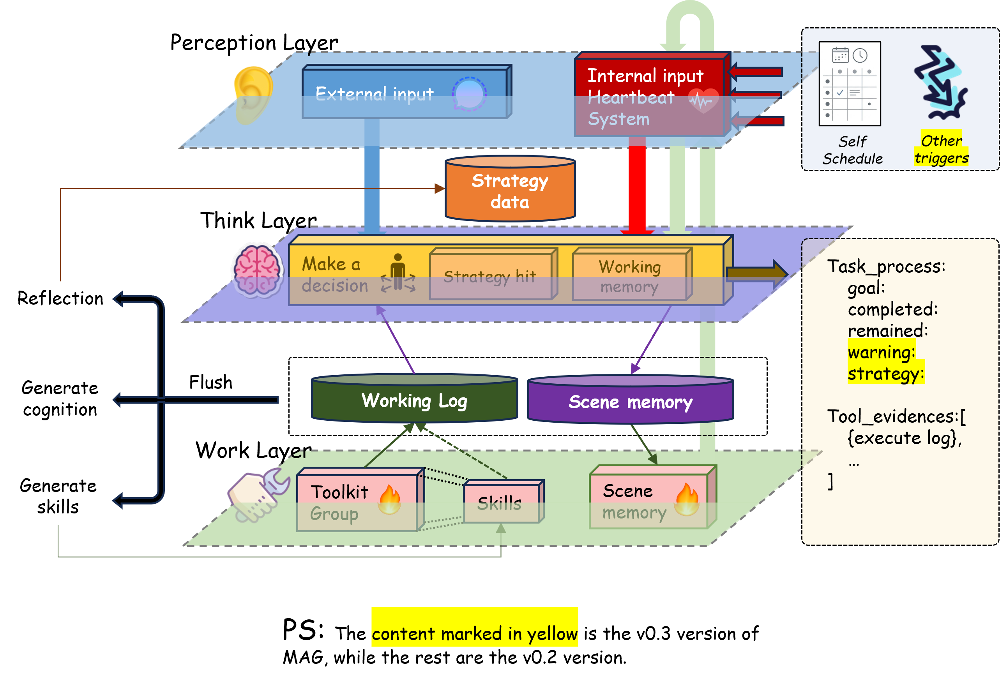

# M-Agent

**M-Agent** 是一个以**记忆**为核心、面向**个人信息生活**的智能体框架。



## 运行方式

### 服务端（Chat API）

使用 **`python -m m_agent.api.chat_api`** 以 **HTTP / SSE 长驻服务** 方式运行智能体：为每条用户消息创建 run、订阅事件流、读取最终结果，服务端维护 **thread 级** 会话状态。

**Think-life 是唯一的产品运行时。** 刺激经 **感知总线** 入队，WM 按事务隔离，**Scene log** 按时间序记录完整时间线，用户可见回复仅通过 **`reply_to_user`** 工具发出；日程心跳与执行反馈也走同一运行时路径。规格见 **[当前 Runtime 说明](docs/runtime/think-life-runtime-spec.zh-CN.md)**。

### 应用端

- **M-Agent-UI**：最简单的信息交互形式【已推出】
- **M-Agent-desktop**：桌面形式的助手

---

## 仓库结构

主代码位于 `src/m_agent/`，可执行入口集中在 `scripts/`，自动化测试在 `tests/`，示例在 `examples/`，实验性集成在 `experiments/`。配置在 `config/`，运行产物多在 `data/` 与 `log/`。

更完整的目录说明与设计约定见：**[项目结构说明](docs/development/project-structure.md)**。

---

## 环境要求

- **Python**：`>= 3.10`（见 `pyproject.toml`）
- **Neo4j（可选）**：当启用图存储/实体关系相关能力时需要（需自行安装并保证连接配置与项目一致）
- **LLM / 嵌入 / Rerank**：通过 `.env` 与 `config/` 下的 YAML 指定兼容 OpenAI 或阿里云等提供商（见下文）

---

## 安装

在项目根目录：

```powershell
# Windows PowerShell 示例
python -m venv .venv
.\.venv\Scripts\activate
python -m pip install --upgrade pip
pip install -r requirements.txt
```

也可使用可编辑安装（便于本地开发）：

```bash
pip install -e .
```

---

## 环境变量（`.env`）

在项目根目录创建 `.env`，按需填写密钥与基础 URL。以下为常见项（具体以仓库内配置注释为准）：

```dotenv
# Chat / RAG LLM（如 src/m_agent/load_model/OpenAIcall.py）
# API_SECRET_KEY 与 OPENAI_API_KEY 二选一填写即可
API_SECRET_KEY=你的_OpenAI_兼容密钥
OPENAI_API_KEY=
BASE_URL=https://api.openai.com/v1

# Chat 模型（config/agents/chat/chat_model.yaml）
DEEPSEEK_API_KEY=你的_DeepSeek_密钥

# RAG 嵌入（config/systems/episodic/rag_default.yaml 的 embed_model）
ALIBABA_API_KEY=你的_阿里云_Key
ALIBABA_BASE_URL=https://dashscope.aliyuncs.com/compatible-mode/v1
ALIBABA_EMBED_MODEL=text-embedding-v4
# Rerank：兼容接口示例；新加坡地域可改用 dashscope-intl

# 可选开关（与当前仓库默认保持一致即可）
LANGUAGE=zh
EMBED_PROVIDER=aliyun
LLM_PROVIDER=deepseek

# Web search (Tavily / You.com — optional, for web_search tool)
YDC_API_KEY=你的_You.com_密钥
TAVILY_API_KEY=你的_Tavily_密钥
```

---

## 用法一：Chat API 后台常态启动（FastAPI）

仓库提供基于 **启动时固定配置 + 线程级会话状态** 的 HTTP / SSE 对话服务（非「每次请求携带完整 config」模式）。服务始终运行 Think-life。

### 启动服务

```powershell
$env:PYTHONPATH = "src"
python -m m_agent.api.chat_api `
  --host 127.0.0.1 `
  --port 8777 `
  --config config/agents/chat/chat_controller.yaml `
  --idle-flush-seconds 1800 `
  --history-max-rounds 12 `
  --schedule-beat-seconds 10 `
  --users-db config/users/users.json `
  --session-ttl-seconds 43200
```

Think-life 参数（每事务最大委托次数、Scene 上下文条数、是否抢占等）在 `chat_controller.yaml` 的 `runtime.think_life` 下配置。

### 启动后

- Swagger：`http://127.0.0.1:8777/docs`
- OpenAPI JSON：`http://127.0.0.1:8777/openapi.json`

完整接口说明、认证、线程事件与日程等见：**[docs/chat_api/README.md](docs/chat_api/README.md)**。

### Bash（Linux / macOS）

```bash
export PYTHONPATH=src
python -m m_agent.api.chat_api \
  --host 127.0.0.1 \
  --port 8777 \
  --config config/agents/chat/chat_controller.yaml
```


## 本仓库的情景记忆（简单 RAG）

Chat 栈默认使用 **RAG 情景后端**（`SimpleRagEpisodicBackend`），配置见 `config/systems/episodic/rag_default.yaml`：每轮与 flush 时写入用户目录下的向量索引，经 `shallow_recall` / `deep_recall` 检索。

- **可插拔专题：** [docs/systems-plugin/](docs/systems-plugin/)（WM / 情景记忆 / 工具，各中英一篇）
- **RAG 索引**：`data/memory/chat-api/<用户>/episodic/`（`chunks.jsonl`、`embeddings.npy`）
- **对话归档**（flush）：`data/memory/chat-api/<用户>/dialogues/`
- **Scene log**：`data/memory/chat-api/<用户>/scene/<thread_id>.jsonl` — 跨事务、按时间序的「讲了什么 / 做了什么」记录
- **与 WM 区别**：WM 按 **事务** 隔离，为进程内热上下文；episodic / Scene 可跨轮检索或按时间轴阅读

开发细节见 **[docs/systems-plugin/episodic.zh-CN.md](docs/systems-plugin/episodic.zh-CN.md)**（持久化路径）；`GET .../memory/state` 返回 `thread_state.episodic_persistence`。

## WorkspaceMem（完整记忆栈与评测）

基于证据驱动的 **MemoryAgent / MemoryCore** 及 **LoCoMo / LongMemEval / REALTALK** 评测管线已迁至独立仓库：

**[F:/AI/WorkspaceMem](F:/AI/WorkspaceMem)**（`workspace_mem` 包）

- **[docs/development/project-structure.md](docs/development/project-structure.md)** — M-Agent 目录约定
- **[src/m_agent/systems/README.zh-CN.md](src/m_agent/systems/README.zh-CN.md)** — 可插拔子系统说明

---


## 测试

```bash
pytest
```

标记与策略见 `pyproject.toml` 中 `[tool.pytest.ini_options]`。

---

## 文档索引

| 文档 | 内容 |
| --- | --- |
| [docs/README.md](docs/README.md) | 文档索引与阅读顺序 |
| [docs/development/project-structure.md](docs/development/project-structure.md) | 目录约定与常用命令 |
| [docs/chat_api/README.md](docs/chat_api/README.md) | Chat API 完整参考 |
| [docs/runtime/think-life-runtime-spec.zh-CN.md](docs/runtime/think-life-runtime-spec.zh-CN.md) | 当前 Think-life 运行时规格 |
| [docs/architecture/README.md](docs/architecture/README.md) | 目标架构与迁移文档 |
| [tools/M-Agent-UI/API.md](tools/M-Agent-UI/API.md) | 前端对接 API 说明 |

---

## 许可证

本项目使用 **MIT License**，详见根目录 [LICENSE](LICENSE)。

---

**English README：** [README.md](README.md)
