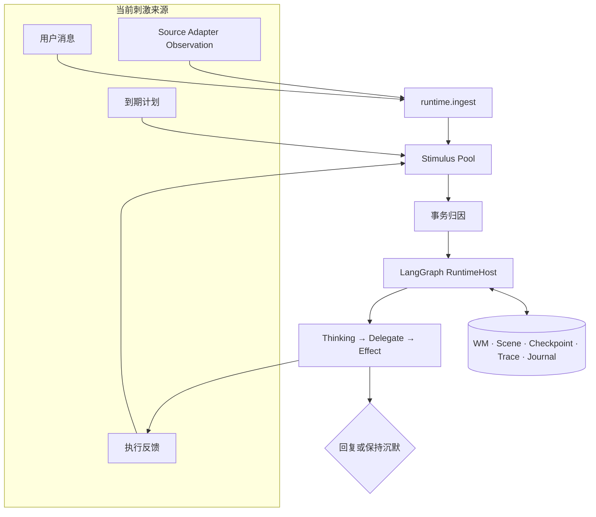

<a name="m-agent"></a>
<h1 align="center">M-Agent</h1>

<p align="center">
  <strong>Stimulus-Native Cognitive Runtime（刺激原生认知运行时）</strong><br>
  为需要持续感知世界变化的 Agent 提供持久认知环境。
</p>

<p align="center">
  <a href="https://www.python.org/"></a>
  <a href="docs/runtime/README.md"></a>
  
  <a href="LICENSE"></a>
</p>

<p align="center">
  <a href="README.md">English</a> ·
  <a href="#quick-start">快速开始</a> ·
  <a href="#how-it-works">运行机制</a> ·
  <a href="#roadmap">路线图</a> ·
  <a href="#documentation">文档</a>
</p>

<p align="center">
  
</p>

<p align="center"><sub>目标刺激—认知闭环的概念视觉；当前实现边界见下文。</sub></p>

<p align="center"><strong>说一次，持续接得上；需要你时才出现。</strong></p>

M-Agent 正在构建一套独立于单次 LLM 调用而持续存在的运行环境。当前 **v0.3.1** 在 v0.3.0 Stimulus Kernel Public Alpha 之上完成 Chat Source Adapter 收敛（`runtime.ingest(observation)`、Observation/Stimulus 契约、Source Adapter 与 Stimulus Lab）。

> [!IMPORTANT]
> **当前源码版本：`0.3.1`。** 外部开发者可通过 `runtime.ingest()` 接入 Source Adapter；产品 Chat 经 `ChatSourceAdapter` 接纳。剩余非 Chat 旁路清理仍在 v0.3.x；下一条主线（v0.4+）是长时记忆（情景 + 经验），Attention/`ignored` 推迟到正式开源后的 v1.x+。

| 当前基础 | 提供的能力 |
| --- | --- |
| ⚡ **统一刺激路径** | 用户消息、到期计划和执行结果进入同一条 Runtime 路径。 |
| 🧭 **持续事务** | TaskState、工作记忆与 Scene 让任务在多轮之间保持连续。 |
| 🔁 **可恢复反馈闭环** | Checkpoint、Effect Ledger 与 Journal 支撑反馈和重启恢复。 |

<a name="quick-start"></a>

## 快速开始

### 1. 安装

要求 Python `>=3.10`。

```powershell
python -m venv .venv
.\.venv\Scripts\activate
python -m pip install --upgrade pip
python -m pip install -e ".[acceptance]"
```

Linux / macOS 使用 `source .venv/bin/activate` 激活环境。
根目录 `requirements.txt` 用于安装可选研究/模型集成，不是最小 Chat Runtime 的前置条件。

### 2. 配置

在仓库根目录创建 `.env`。当前 Chat 模型通过 OpenAI-compatible 接口访问，以下两个密钥变量任选其一。

```dotenv
API_SECRET_KEY=你的兼容接口密钥
# OPENAI_API_KEY=你的兼容接口密钥
BASE_URL=https://你的服务地址/v1
```

<details>
<summary><strong>可选的 Embedding、Rerank 与网页搜索凭据</strong></summary>

默认简单 RAG 使用本地 `hash` 表示；只有在 YAML 中启用相应集成时才需要以下凭据。

```dotenv
# Alibaba embedding / rerank
ALIBABA_API_KEY=
ALIBABA_BASE_URL=https://dashscope.aliyuncs.com/compatible-mode/v1
ALIBABA_EMBED_MODEL=text-embedding-v4

# Web search
YDC_API_KEY=
TAVILY_API_KEY=
```

</details>

### 3. 启动

```powershell
m-agent-chat --host 127.0.0.1 --port 8777 --disable-auth
```

该命令默认读取随 wheel 安装的公共配置；只有在维护自定义配置树时才需要传 `--config PATH`。

默认 profile 以读取为主。日程写入和 Gmail 发送只能通过显式的
`config/agents/chat/chat_controller_external_writes.yaml` profile 启用；Gmail 发送使用
独立的 send-scope OAuth token。

| 启动后访问 | 地址 |
| --- | --- |
| Swagger UI | `http://127.0.0.1:8777/docs` |
| OpenAPI JSON | `http://127.0.0.1:8777/openapi.json` |
| 健康检查 | `http://127.0.0.1:8777/healthz` |

认证、HTTP、SSE、Thread、Transaction、Scene、Memory 与 Schedule 契约见 [Chat API 参考](docs/chat_api/README.md)。

<a name="how-it-works"></a>

## 运行机制

用户消息只是刺激的一种。时间、行动结果和世界变化，也可能让一个持续存在的 Agent 重新判断接下来应该做什么。

| 刺激来源 | 状态 |
| --- | --- |
| 💬 **用户输入** | 消息与回复使用当前 Runtime 路径 |
| ⏰ **时间** | 到期计划与 Heartbeat 使用当前 Runtime 路径 |
| 🛠️ **行动结果** | 工具成功、失败与执行反馈会返回 Runtime |
| 🌍 **世界变化** | Public Alpha：Source Adapter → `runtime.ingest(observation)` |



> [!NOTE]
> v0.3.1 覆盖 Observation/Stimulus 接纳、Source Adapter，以及经 `ChatSourceAdapter` 的 Chat 路径。`submit_user_message` 仍为兼容薄封装。剩余非 Chat 旁路清理仍在 v0.3.x 线上。

<a name="capabilities"></a>

## 当前能力边界

### ✅ 当前 Runtime 已实现

| 范围 | 当前能力 |
| --- | --- |
| Runtime | LangGraph-backed `RuntimeHost`（`langgraph_v1`） |
| 连续性 | 持续存在的 Transaction、TaskState、Activation 与 Scene 时间线 |
| 刺激 | 耐久 Stimulus Pool（池状态 / 处置拆分）与 Trace |
| 输入 | `runtime.ingest(observation)`、消息、计划与执行反馈 |
| Adapter | Source Adapter 模板、Chat Source Adapter 与离线 Stimulus Lab |
| 认知 | Thinking、Delegate、Effect、Feedback 与用户回复闭环 |
| 恢复 | SQLite checkpoint、effect ledger、带 Journal 的 Flush 重启恢复与 Schedule lease 恢复 |
| 记忆 | Transaction 级 WM 与由模型调用的简单 RAG |

### 🧭 已规划、尚未实现

| 目标版本 | 规划能力 |
| --- | --- |
| v0.3.x | 消除剩余非 Chat 旁路后再离开 v0.3 线 |
| v0.4 | 情景记忆子系统：Flush 录入、系统浅召回、工具深召回 |
| v0.5 | 经验子系统：Flush 录入与仅系统召回 |
| v0.6 | 两子系统拼入主链，并稳定宿主运行时 |
| v0.7 | Cognitive State 与 Context Compiler（WM + 浅情景 + 经验） |
| v0.8–0.9 | 时间/内生刺激、Opt-in Strategy、受控自主与 RC 硬化 |
| v1.x+ | Attention/`ignored` 与开放事件流归因（刺激种类变多之后） |

可执行语义验收覆盖 Transaction、Stimulus Pool、Attribution 和恢复行为。目标能力安排在 v0.3.0—v1.0.0，而不是包装成当前现状。

## 记忆模型

| 机制与状态 | 控制方式 |
| --- | --- |
| 🔎 **工具记忆 · 当前可用** | 模型意识到需要回忆后，主动调用 RAG、搜索或档案工具；当前 `SimpleRagEpisodicBackend` 属于这一类；v0.4 深召回保持这一控制权模型。 |
| 🧠 **情景记忆子系统 · 路线图** | 自洽情景记忆：Flush 录入、**系统**浅召回（高限制）、**工具**深召回。v0.4 建成子系统，v0.6 拼入主链。 |
| 📘 **经验子系统 · 路线图** | 自洽经验记忆：Flush 录入与**仅系统召回**。v0.5 建成子系统，v0.6 拼入主链。 |
| 🧭 **Strategy · 路线图** | 从经验子系统生长出的程序性指导，通过安全门槛后 Opt-in。v0.8.0 Opt-in。 |

## 持久化一览

| 范围 | 位置 / 机制 | 用途 |
| --- | --- | --- |
| Transaction WM | 进程内、事务隔离 | 当前活动事务的热上下文 |
| Scene | `data/memory/chat-api/<用户>/scene/<thread_id>.jsonl` | 对话与 Effect 的时间线 |
| Dialogue | Flush 物化 | 持久对话归档 |
| Episodic index | `data/memory/chat-api/<用户>/episodic/` | 跨轮工具记忆 |
| Runtime state | SQLite checkpoint、effect ledger、flush journal | 事务、刺激、Effect 与 Flush 的耐久恢复 |

实现细节见[可插拔子系统指南](docs/systems-plugin/README.zh-CN.md)和[当前 Runtime 文档](docs/runtime/README.md)。

<a name="roadmap"></a>

## 路线图

| 阶段 | 结果 |
| --- | --- |
| **当前版本 · v0.3.1** | Stimulus Kernel 之上的 Chat Source Adapter |
| **v0.3.x → v0.6** | Ingress Freeze，再建成情景/经验子系统并拼入稳定主链 |
| **v0.7–0.9** | Context Compiler、时间/内生认知、受控自主与 RC |
| **v1.0 / v1.x+** | 正式开源初步完整认知运行时；Attention 留待生态期 |

<details>
<summary><strong>展开完整 v0.2.0 → v1.0.0 规划</strong></summary>

| 版本 | 主题 | 核心目标 |
| --- | --- | --- |
| v0.2.0 | 当前运行时基线 | 固化 Transaction、Scene、Stimulus、Schedule、Effect/Feedback 与工具记忆 |
| v0.2.1 | 可信基线 | 修复恢复、上下文、记忆正确性、安全默认值和开源交付 |
| v0.3.0 | Stimulus Kernel | 公开 Observation/Stimulus 协议、`runtime.ingest()`、进程式池状态、确定性处置、Trace、Source Adapter 与 Stimulus Lab |
| v0.3.1 | Chat Source Adapter | 产品 Chat 经 `ChatSourceAdapter` → `ingest`；`submit_user_message` 降为兼容薄封装 |
| v0.4.0 | 情景记忆子系统 | Flush 录入、系统浅召回、工具深召回，子系统自洽 |
| v0.5.0 | 经验子系统 | Flush 录入与仅系统召回，与情景记忆解耦 |
| v0.6.0 | 长时记忆接入与主系统稳定 | 两子系统拼入主链；Flush 只触发；长时间运行稳定 |
| v0.7.0 | Cognitive State & Context Compiler | 将 WM、浅情景与经验编译为可追溯 Context Snapshot |
| v0.8.0 | Temporal, Endogenous & Strategy | Clock/Expectation、内生刺激、Opt-in Strategy |
| v0.9.0 | Bounded Autonomy & RC | 权限、预算、审批、Kill Switch、迁移与长期运行硬化 |
| v1.0.0 | 初步完整认知运行时 | 正式开源稳定契约（Attention 推迟到 v1.x+） |
| v1.x+ | Attention & Attribution | 刺激种类变多后的噪声过滤与开放事件流归因 |

</details>

完整交付项和放行条件见[版本规划](docs/roadmap-v0.2.0-v1.0.0.zh-CN.md)或[可分发 PDF](docs/pdf/M-Agent-Roadmap-v0.2.0-v1.0.0.zh-CN.pdf)。

## 测试

```bash
pytest
```

<details>
<summary><strong>Runtime 语义验收与迁移 Gate</strong></summary>

```powershell
python -m m_agent.acceptance contract run --runtime langgraph_v1 --all-layers
python scripts/run_runtime_migration_gate.py --rounds 3
```

</details>

详见 [Runtime 语义验收平台](docs/runtime/semantic-acceptance-platform.zh-CN.md)。

<a name="documentation"></a>

## 文档

| | 从这里开始 | 内容 |
| --- | --- | --- |
| 🧭 | [哲学动机（中英）](docs/philosophy-motivation.md) | 连续主体、意识能动四层与 `A=f(c)` 建模动机 |
| 🌟 | [愿景与目标](docs/vision-and-goals.zh-CN.md) | 项目定位、用户价值、记忆边界和成功判据 |
| 🗺️ | [版本规划](docs/roadmap-v0.2.0-v1.0.0.zh-CN.md) | v0.2.0—v1.0.0 的目标、交付与 Gate |
| 📝 | [版本变更](CHANGELOG.md) | 各版本已交付变更与兼容性说明 |
| 🏗️ | [目标架构](docs/architecture/cognitive-runtime-architecture.zh-CN.md) | Signal 到 Effect Feedback 的目标链路 |
| 🔌 | [Chat API](docs/chat_api/README.md) | 认证、HTTP、SSE 与 Runtime 接口 |
| 🧩 | [子系统插件](docs/systems-plugin/README.zh-CN.md) | WM、Episodic 与 Tools 的当前扩展契约 |
| 📚 | [文档总索引](docs/README.md) | 活动文档、目标设计、历史归档和路线图 PDF |

## 仓库结构

```text
M-Agent/
├── src/m_agent/   # Runtime、分层、系统与 API
├── config/        # Agent、系统与集成配置
├── tests/         # 单元、集成、契约与验收测试
├── scripts/       # Smoke、Gate 与维护脚本
├── docs/          # 架构、API、运维与路线图
└── tools/         # 参考客户端与工具
```

详见[项目结构指南](docs/development/project-structure.md)。

## 许可证

M-Agent 使用 [MIT License](LICENSE)。

<p align="center"><a href="README.md">English</a> · <a href="#m-agent">返回顶部</a></p>
