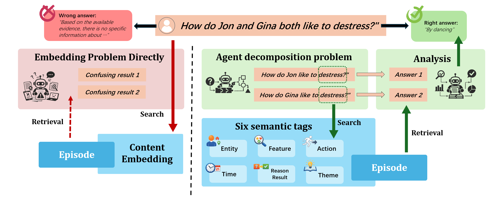

# M-Agent

### **M-Agent: A Multi-Dimensional Memory Agent for Long-Term Dialogue Question Answering**

M-Agent is an **Agent-Memory** system for **Long-Term Dialogue QA**, designed to address semantic mismatch issues that standard RAG pipelines often face in memory retrieval.

In long-horizon dialogue memory, user questions are often **abstract, cross-temporal, and reasoning-heavy**, while raw evidence is usually **local and concrete text fragments**.
This semantic-level gap between **query** and **evidence** makes pure embedding-similarity retrieval unreliable.

M-Agent introduces **Retrieval Target Decomposition** and **Multi-Dimensional Memory Retrieval**, building a scalable memory retrieval system so the agent can invoke the right retrieval tools for different question types and improve answer accuracy.


Figure 1. Comparison between direct embedding retrieval and the M-Agent retrieval framework.
Left: directly embedding the question can cause incorrect recalls or fail to find valid evidence for multi-entity or abstract-relation questions.
Right: M-Agent first decomposes the question into sub-questions, retrieves evidence through six semantic labels (Entity, Feature, Action, Time, Reason-Result, Theme), and then analyzes recalled episodes to produce the final answer.

---
### **TODO**
Current refactor direction:
1. System input has switched from `kg_candidates` to `episodes`.
2. `Episode -> Scene -> Atomic facts` is generated inside `MemoryCore`.
3. `persistence` layer is removed; `KGBase` now executes entity/relation operations directly on local Neo4j.
---
### **Project Layout**

Core source code now lives under `src/m_agent/`, runnable entry scripts live under `scripts/`, automated tests live under `tests/`, examples live under `examples/`, and experimental integrations live under `experiments/`.

For a fuller tree and rationale, see `docs/project-structure.md`.
---
### **Quick_start**

The following steps only cover the path from zero to running `run_eval_locomo.py`.

1. Enter the project root and create a virtual environment

```bash
# Windows PowerShell
python -m venv .venv
.\.venv\Scripts\activate

# macOS / Linux
# python3 -m venv .venv
# source .venv/bin/activate
```

2. Install dependencies

```bash
python -m pip install --upgrade pip
pip install -r requirements.txt
```

3. Create `.env` in the project root and fill the fields below

```dotenv
# MemoryCore LLM: src/m_agent/load_model/OpenAIcall.py
# Fill one of API_SECRET_KEY or OPENAI_API_KEY
API_SECRET_KEY=YOUR_OPENAI_COMPATIBLE_KEY
OPENAI_API_KEY=
BASE_URL=https://api.openai.com/v1

# Agent model key: model_name=deepseek-chat (config/prompt/agent_sys.yaml)
DEEPSEEK_API_KEY=YOUR_DEEPSEEK_KEY

# Embedding key: embed_provider (config/memory_core_config/*.yaml)
ALIBABA_API_KEY=YOUR_ALIBABA_KEY
ALIBABA_BASE_URL=https://dashscope.aliyuncs.com/compatible-mode/v1
ALIBABA_EMBED_MODEL=text-embedding-v4

# Optional switches (keep consistent with current repo defaults)
LANGUAGE=zh
EMBED_PROVIDER=aliyun
LLM_PROVIDER=deepseek
```

4. Run LoCoMo preprocessing first (`memory_pre`, now only builds dialogues + episodes)

> `run_eval_locomo.py` uses `config/prompt/agent_sys.yaml` by default.
> In that file, `memory_core_config_path` points to `config/memory_core_config/agent_sys_memory.yaml`,
> where `workflow_id` is configured. Keep preprocessing `--id` consistent with that `workflow_id`.

```bash
python scripts/memory_pre.py --id testlocomo --data-source data/locomo/data/locomo10.json --loader-type locomo
```

After preprocessing, these folders will be generated/updated under `data/memory/testlocomo/`:

- `dialogues/`
- `episodes/`
- `scene/` (generated later by MemoryCore import from `episodes/`)

5. Run LoCoMo evaluation

```bash
# Quick check: sampled run
python scripts/run_eval_locomo.py --test-id quickstart --sample-fraction 0.1

# Full run: 10/10 samples
# python scripts/run_eval_locomo.py --test-id quickstart-full --sample-fraction 1.0
```

6. Check outputs

- `log/<test-id>/locomo10_agent_qa.json`
- `log/<test-id>/locomo10_agent_qa_stats.json`
- `log/<test-id>/locomo10_agent_qa_run.log`
- `log/<test-id>/locomo10_agent_qa_qa_trace.jsonl`

Each QA item now also stores intermediate decomposition fields such as
`memory_agent_prediction_plan`, `memory_agent_prediction_sub_questions`, and
`memory_agent_prediction_plan_summary`, so you can inspect whether the agent
actually decomposed the question before retrieving evidence.
