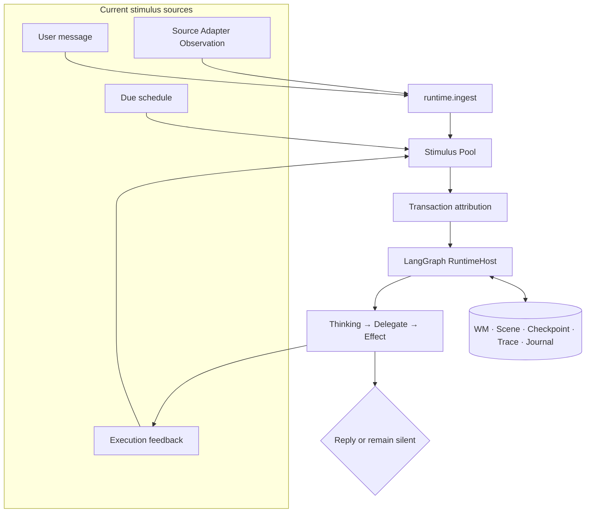

<a name="m-agent"></a>
<h1 align="center">M-Agent</h1>

<p align="center">
  <strong>A Stimulus-Native Cognitive Runtime</strong><br>
  Persistent cognition for agents that must keep up with a changing world.
</p>

<p align="center">
  <a href="https://www.python.org/"></a>
  <a href="docs/runtime/README.md"></a>
  
  <a href="LICENSE"></a>
</p>

<p align="center">
  <a href="README-zh.md">简体中文</a> ·
  <a href="#quick-start">Quick start</a> ·
  <a href="#how-it-works">How it works</a> ·
  <a href="#roadmap">Roadmap</a> ·
  <a href="#documentation">Documentation</a>
</p>

<p align="center">
  
</p>

<p align="center"><sub>Concept visual of the target stimulus-to-cognition loop; current implementation boundaries are documented below.</sub></p>

<p align="center"><strong>Say it once. It keeps up—and only comes to you when needed.</strong></p>

M-Agent is building a runtime that persists beyond a single LLM call. The current **v0.3.1** release adds Chat Source Adapter convergence on top of the v0.3.0 Stimulus Kernel Public Alpha (`runtime.ingest(observation)`, Observation/Stimulus contracts, Source Adapters, and Stimulus Lab).

> [!IMPORTANT]
> **Current source release: `0.3.1`.** External developers can attach Source Adapters through `runtime.ingest()`; product Chat admits via `ChatSourceAdapter`. Remaining non-Chat ingress bypass cleanup stays on v0.3.x; next major line (v0.4+) is long-term memory (episodic + experience), not Attention/`ignored` (deferred to v1.x+ after open source).

| Foundation | What it provides |
| --- | --- |
| ⚡ **Shared stimulus path** | User messages, due schedules, and execution outcomes enter one runtime path. |
| 🧭 **Persistent transactions** | TaskState, working memory, and Scene preserve continuity across turns. |
| 🔁 **Recoverable feedback loop** | Checkpoints, effect ledgers, and journals support feedback and restart recovery. |

<a name="quick-start"></a>

## Quick start

### 1. Install

Python `>=3.10` is required.

```powershell
python -m venv .venv
.\.venv\Scripts\activate
python -m pip install --upgrade pip
python -m pip install -e ".[acceptance]"
```

On Linux or macOS, activate the environment with `source .venv/bin/activate`.
The root `requirements.txt` installs optional research/model integrations and
is not required for the minimal chat runtime.

### 2. Configure

Create `.env` in the repository root. The current chat model uses an OpenAI-compatible API; either key variable is accepted.

```dotenv
API_SECRET_KEY=YOUR_COMPATIBLE_API_KEY
# OPENAI_API_KEY=YOUR_COMPATIBLE_API_KEY
BASE_URL=https://your-provider.example/v1
```

<details>
<summary><strong>Optional embedding, rerank, and web-search credentials</strong></summary>

The default simple RAG backend uses local `hash` representations, so these credentials are only needed when their integrations are enabled in YAML.

```dotenv
# Alibaba embedding / rerank
ALIBABA_API_KEY=
ALIBABA_BASE_URL=https://dashscope.aliyuncs.com/compatible-mode/v1
ALIBABA_EMBED_MODEL=text-embedding-v4

# Web search
YDC_API_KEY=
TAVILY_API_KEY=
```

</details>

### 3. Run

```powershell
m-agent-chat --host 127.0.0.1 --port 8777 --disable-auth
```

The command uses the packaged default configuration. Pass `--config PATH` only
when you intentionally maintain a custom configuration tree.

The default profile is read-oriented. Schedule mutations and Gmail sending are
available only through the explicit
`config/agents/chat/chat_controller_external_writes.yaml` profile; Gmail send
uses a separate send-scoped OAuth token.

| Open after startup | URL |
| --- | --- |
| Swagger UI | `http://127.0.0.1:8777/docs` |
| OpenAPI JSON | `http://127.0.0.1:8777/openapi.json` |
| Health check | `http://127.0.0.1:8777/healthz` |

See the [Chat API reference](docs/chat_api/README.md) for authentication, HTTP, SSE, Thread, Transaction, Scene, Memory, and Schedule contracts.

<a name="how-it-works"></a>

## How it works

A user message is only one kind of stimulus. Time, action outcomes, and changes in the world can also make a persistent agent reconsider what it should do.

| Stimulus source | Status |
| --- | --- |
| 💬 **User input** | Messages and replies use the current runtime path |
| ⏰ **Time** | Due schedules and heartbeats use the current runtime path |
| 🛠️ **Action outcomes** | Tool success, failure, and execution feedback return to the runtime |
| 🌍 **World changes** | Public Alpha: Source Adapters → `runtime.ingest(observation)` |


```mermaid
flowchart TB
    subgraph inputs["Current stimulus sources"]
        user["User message"]
        schedule["Due schedule"]
        feedback["Execution feedback"]
        observation["Source Adapter Observation"]
    end

    ingest["runtime.ingest"]
    inbox["Stimulus Pool"]
    attribution["Transaction attribution"]
    runtime["LangGraph RuntimeHost"]
    cognition["Thinking → Delegate → Effect"]
    outcome{"Reply or remain silent"}
    persistence[("WM · Scene · Checkpoint · Trace · Journal")]

    user --> ingest
    schedule --> inbox
    feedback --> inbox
    observation --> ingest --> inbox
    inbox --> attribution --> runtime --> cognition --> outcome
    cognition --> feedback
    runtime <--> persistence
```

> [!NOTE]
> v0.3.1 covers Observation/Stimulus admission, Source Adapters, and Chat via `ChatSourceAdapter`. `submit_user_message` remains a compatibility facade. Remaining non-Chat ingress bypass cleanup is still on the v0.3.x line.

<a name="capabilities"></a>

## What works today

### ✅ Implemented in the current runtime

| Area | Available today |
| --- | --- |
| Runtime | LangGraph-backed `RuntimeHost` (`langgraph_v1`) |
| Continuity | Persistent Transaction, TaskState, Activation, and Scene timelines |
| Stimuli | Durable Stimulus Pool with pool state / disposition split and Trace |
| Inputs | `runtime.ingest(observation)`, messages, schedules, and execution feedback |
| Adapters | Source Adapter templates, Chat Source Adapter, and offline Stimulus Lab |
| Cognition | Thinking, Delegate, Effect, Feedback, and user-reply loops |
| Recovery | SQLite checkpoints, effect ledger, journaled Flush restart recovery, and schedule lease recovery |
| Memory | Transaction-scoped WM and model-invoked simple RAG |

### 🧭 Planned, not yet implemented

| Target | Planned capability |
| --- | --- |
| v0.3.x | Remove remaining non-Chat ingress bypasses before leaving the v0.3 line |
| v0.4 | Episodic memory subsystem: flush ingest, system shallow recall, tool deep recall |
| v0.5 | Experience subsystem: flush ingest and system-only recall |
| v0.6 | Splice both memory subsystems into the main path; stabilize the host runtime |
| v0.7 | Cognitive State & Context Compiler (WM + shallow episodic + experience) |
| v0.8–0.9 | Temporal/endogenous stimuli, opt-in Strategy, bounded autonomy, RC hardening |
| v1.x+ | Attention/`ignored` and open-stream attribution after stimulus diversity grows |

The executable semantic-acceptance suite covers Transaction, Stimulus Pool, Attribution, and recovery behavior. Target capabilities are scheduled across v0.3.0–v1.0.0.

## Memory model

| Mechanism & status | Control model |
| --- | --- |
| 🔎 **Tool memory · available now** | The model notices that it needs to remember and explicitly calls RAG, search, or archive tools. Current `SimpleRagEpisodicBackend` belongs here; v0.4 deep recall keeps this control model. |
| 🧠 **Episodic subsystem · roadmap** | Self-contained episodic memory: flush ingest, **system** shallow recall (strict limits), **tool** deep recall. v0.4 builds the subsystem; v0.6 splices it into the main path. |
| 📘 **Experience subsystem · roadmap** | Self-contained experience memory: flush ingest and **system-only** recall. v0.5 builds the subsystem; v0.6 splices it into the main path. |
| 🧭 **Strategy · roadmap** | Procedural guidance grown from the experience subsystem after safety gates. Opt-in in v0.8.0. |

## Persistence at a glance

| Scope | Location / mechanism | Purpose |
| --- | --- | --- |
| Transaction WM | In-process, transaction-scoped | Hot context for one active transaction |
| Scene | `data/memory/chat-api/<user>/scene/<thread_id>.jsonl` | Chronological conversation and effect timeline |
| Dialogue | Flush materialization | Durable dialogue archives |
| Episodic index | `data/memory/chat-api/<user>/episodic/` | Cross-turn tool memory |
| Runtime state | SQLite checkpoint, effect ledger, flush journal | Durable recovery for transactions, stimuli, effects, and flushes |

See the [pluggable-subsystem guide](docs/systems-plugin/README.md) and [current Runtime documentation](docs/runtime/README.md) for implementation details.

<a name="roadmap"></a>

## Roadmap

| Phase | Outcome |
| --- | --- |
| **Current · v0.3.1** | Chat Source Adapter on Stimulus Kernel Public Alpha |
| **v0.3.x → v0.6** | Ingress freeze, then episodic + experience subsystems spliced into a stable main path |
| **v0.7–0.9** | Context Compiler, temporal/endogenous cognition, bounded autonomy, RC |
| **v1.0 / v1.x+** | Open-source stable preliminary cognitive runtime; Attention after ecosystem growth |

<details>
<summary><strong>View the complete v0.2.0 → v1.0.0 plan</strong></summary>

| Version | Theme | Primary objective |
| --- | --- | --- |
| v0.2.0 | Runtime baseline | Establish Transaction, Scene, Stimulus, Schedule, Effect/Feedback, and tool-memory foundations |
| v0.2.1 | Trusted baseline | Fix recovery, context and memory correctness, safe defaults, and open-source delivery |
| v0.3.0 | Stimulus Kernel | Publish Observation/Stimulus contracts, `runtime.ingest()`, process-like pool state, deterministic dispositions, traces, Source Adapters, and Stimulus Lab |
| v0.3.1 | Chat Source Adapter | Admit product Chat through `ChatSourceAdapter` → `ingest`; keep `submit_user_message` as a facade |
| v0.4.0 | Episodic memory subsystem | Flush ingest, system shallow recall, tool deep recall as a self-contained subsystem |
| v0.5.0 | Experience subsystem | Flush ingest and system-only recall, decoupled from episodic memory |
| v0.6.0 | Long-term memory splice & host stability | Wire both subsystems into the main path; keep flush as trigger-only; stabilize long-running operation |
| v0.7.0 | Cognitive State & Context Compiler | Compile WM, shallow episodic, and experience into traceable Context Snapshots |
| v0.8.0 | Temporal, Endogenous & Strategy | Clock/Expectation, endogenous stimuli, opt-in Strategy guidance |
| v0.9.0 | Bounded Autonomy & RC | Permissions, budgets, approvals, kill switch, migration, and long-running hardening |
| v1.0.0 | Preliminary stable cognitive runtime | Open-source stable contracts (Attention deferred to v1.x+) |
| v1.x+ | Attention & Attribution | Noise filtering and open-stream attribution after stimulus diversity grows |

</details>

Read the [full roadmap](docs/roadmap-v0.2.0-v1.0.0.zh-CN.md) or the [distributable PDF](docs/pdf/M-Agent-Roadmap-v0.2.0-v1.0.0.zh-CN.pdf) for deliverables and release gates.

## Testing

```bash
pytest
```

<details>
<summary><strong>Runtime semantic acceptance and migration gate</strong></summary>

```powershell
python -m m_agent.acceptance contract run --runtime langgraph_v1 --all-layers
python scripts/run_runtime_migration_gate.py --rounds 3
```

</details>

See the [Runtime semantic acceptance platform](docs/runtime/semantic-acceptance-platform.zh-CN.md).

<a name="documentation"></a>

## Documentation

| | Start here | Scope |
| --- | --- | --- |
| 🧭 | [Philosophical motivation](docs/philosophy-motivation.md) | Continuous subject, four layers of conscious agency, and `A=f(c)` modeling *(bilingual)* |
| 🌟 | [Vision and goals](docs/vision-and-goals.zh-CN.md) | Positioning, user value, memory boundaries, and success criteria *(Chinese)* |
| 🗺️ | [Version roadmap](docs/roadmap-v0.2.0-v1.0.0.zh-CN.md) | Goals, deliverables, and gates from v0.2.0 to v1.0.0 *(Chinese)* |
| 📝 | [Release notes](CHANGELOG.md) | Shipped changes and compatibility notes by version |
| 🏗️ | [Target architecture](docs/architecture/cognitive-runtime-architecture.zh-CN.md) | Signal-to-Effect target architecture *(Chinese)* |
| 🔌 | [Chat API](docs/chat_api/README.md) | Authentication, HTTP, SSE, and runtime endpoints |
| 🧩 | [Subsystem plug-ins](docs/systems-plugin/README.md) | Current WM, Episodic, and Tools extension contracts |
| 📚 | [Documentation index](docs/README.md) | Active docs, target designs, archives, and the roadmap PDF |

## Repository layout

```text
M-Agent/
├── src/m_agent/   # runtime, layers, systems, APIs
├── config/        # agents, systems, integrations
├── tests/         # unit, integration, contract, acceptance
├── scripts/       # smoke tests, gates, maintenance
├── docs/          # architecture, API, operations, roadmap
└── tools/         # reference clients and utilities
```

See the [project structure guide](docs/development/project-structure.md).

## License

M-Agent is released under the [MIT License](LICENSE).

<p align="center"><a href="README-zh.md">简体中文</a> · <a href="#m-agent">Back to top</a></p>
