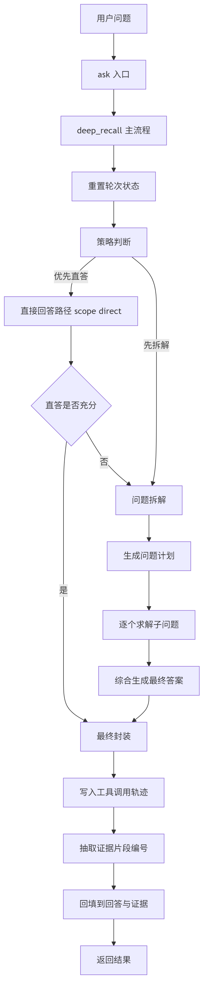
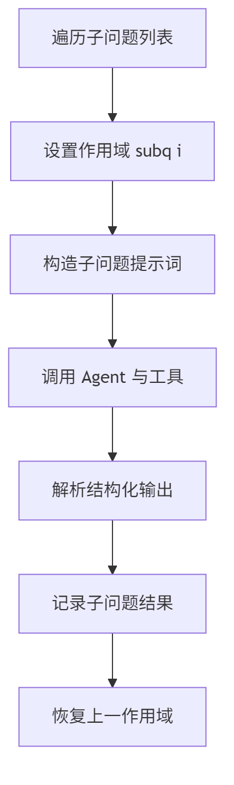
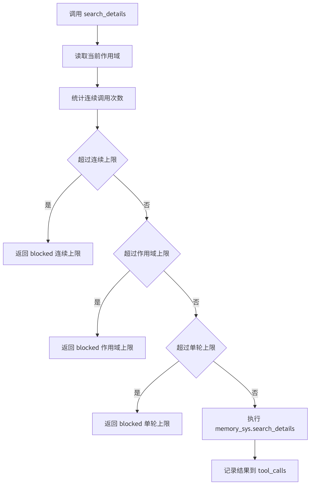

# Memory-Agent 运行流程说明（含流程图）

本文基于当前 `MemoryAgent` 代码路径，说明一次 `ask/deep_recall` 的执行过程，以及你刚刚要求加入的两项机制：

- `search_details` 限流（连续/作用域/单轮）
- 最终回答自动回填证据片段编号（`dialogue_id:episode_id`）

## 1. 主流程（ask -> deep_recall）

主流程要点：

1. `ask(question)` 进入 `deep_recall(question)`。
2. 先重置轮次状态（工具调用轨迹与计数器）。
3. 进行策略判断：
   - 由 LLM 网关先判断是否应该分解；
   - 直答路径不再因为“回答不充分”自动回退到分解。
4. 拆解路径会生成 `question_plan`，逐个求解子问题，再做最终综合。
5. 返回前统一封装结果：
   - 写入 `tool_calls/tool_call_count`
   - 抽取 `evidence_episode_refs`
   - 回填片段编号到 `answer/evidence`

## 2. 子问题求解流程

子问题执行要点：

1. 逐个遍历 `sub_questions`。
2. 每个子问题设置独立 scope（`subq:i`）。
3. 构造子问题提示词并调用工具代理。
4. 解析结构化输出（`answer/gold_answer/evidence`）。
5. 记录结果后恢复上一 scope。

这让“每个子问题单独计数与限流”成为可能，而不是只看整题总次数。

## 3. search_details 限流流程

当前限流顺序：

1. 检查连续调用是否超限。
2. 检查当前作用域调用是否超限。
3. 检查整轮调用是否超限。
4. 任一超限则返回 `blocked=true`，不中断主流程；未超限才真正调用 `memory_sys.search_details`。

默认参数（可在 agent 配置中修改）：

- `max_consecutive_search_details_calls: 3`
- `max_search_details_calls_per_scope: 3`
- `max_search_details_calls_per_round: 20`

## 4. 最终输出（关键字段）

- `answer`
- `gold_answer`
- `evidence`
- `tool_calls`
- `tool_call_count`
- `question_plan`
- `sub_questions`
- `sub_question_results`
- `evidence_episode_refs`
- `evidence_episode_ref_count`

其中 `evidence_episode_refs` 是你要求的“证据所关联的 Episode 片段编号”，格式为：

- `dialogue_id:episode_id`

例如：`dlg_locomo10_conv-30_8:ep_001`
