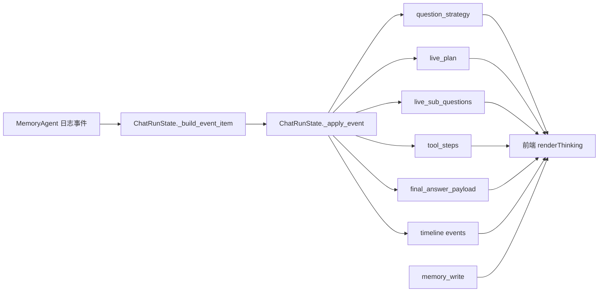

# ChatAgent 运行流程图

这个文档描述当前 `test_agent` 聊天链路的真实执行路径，覆盖：

- 前端 Web UI
- `SimpleMemoryChatAgent`
- `MemoryAgent.ask()`
- 聊天记忆落盘与重新导入 `MemoryCore`
- `Thinking` 面板里的 trace 如何实时更新

相关代码入口：

- `scripts/run_test_agent_web.py`
- `src/m_agent/chat/web_ui.py`
- `src/m_agent/chat/simple_chat_agent.py`
- `src/m_agent/agents/memory_agent.py`
- `config/agents/chat/test_agent_chat.yaml`
- `config/memory/core/test_agent_memory.yaml`

## 1. 总体运行流程

```mermaid
flowchart TD
    U[用户在浏览器输入消息] --> POST[POST /api/chat]
    POST --> H[web_ui.RequestHandler.do_POST]
    H --> V{问题为空或已有运行中任务?}
    V -->|是| ERR[返回 400 / 409]
    V -->|否| BEGIN[ChatRunState.begin_run<br/>写入 user 消息 + assistant 占位]
    BEGIN --> THREAD[启动后台线程 run_chat_once]

    subgraph Worker["后台执行线程"]
        THREAD --> TRACE[挂载 FunctionTraceHandler<br/>监听 MemoryAgent 日志]
        TRACE --> CACHE[_get_cached_chat_agent<br/>首次按 config 创建 Agent]
        CACHE --> CHAT[SimpleMemoryChatAgent.chat]
        CHAT --> ASK[MemoryAgent.ask(question, thread_id)]
        ASK --> ANSWER[得到 answer + agent_result]
        ANSWER --> PM{persist_memory 是否开启?}
        PM -->|是| PERSIST[ChatMemoryPersistence.persist_round]
        PM -->|否| SKIP[返回 memory_write=disabled]

        PERSIST --> WRITE1[写 dialogue JSON<br/>data/memory/test_agent/dialogues/...]
        WRITE1 --> WRITE2[写 episodes_v1.json<br/>data/memory/test_agent/episodes/by_dialogue/...]
        WRITE2 --> WRITE3[生成 eligibility_v1.json<br/>更新 episode_situation.json]
        WRITE3 --> IMPORT[memory_core.load_from_episode_path]
        IMPORT --> RESULT[state.set_result]
        SKIP --> RESULT
    end

    subgraph LiveTrace["Thinking 实时更新链路"]
        ASK -. QUESTION STRATEGY / PLAN UPDATE / TOOL CALL DETAIL / TOOL RESULT DETAIL / FINAL ANSWER PAYLOAD .-> APPEND[state.append_trace]
        APPEND --> SNAP1[更新当前 assistant.trace<br/>plan / sub-questions / tools / timeline]
    end

    subgraph Polling["浏览器轮询"]
        POLL[GET /api/state<br/>每 1 秒轮询] --> SNAP2[ChatRunState.snapshot]
        SNAP2 --> RENDER[前端重绘消息列表<br/>Thinking / Memory Write / Timeline]
    end

    RESULT --> SNAP2
    SNAP1 --> SNAP2
```

## 2. `MemoryAgent.ask()` 内部执行流

```mermaid
flowchart TD
    A[开始 ask(question, thread_id)] --> B[清空本轮 tool call 缓冲]
    B --> C[_detect_direct_answer_strategy]
    C --> D{先直接回答?}

    D -->|是| DP[构建 direct question plan]
    DP --> DA[_answer_directly]
    DA --> RETRY{_should_retry_with_decomposition?}
    RETRY -->|否| DIRECT_OK[统计本轮工具调用数<br/>补齐 question_plan / sub_questions / plan_summary]
    DIRECT_OK --> FINAL1[记录 FINAL ANSWER PAYLOAD]
    FINAL1 --> RETURN1[返回 payload]

    RETRY -->|是| FALLBACK[记录 DIRECT ANSWER FALLBACK]
    FALLBACK --> DECOMP

    D -->|否| DECOMP[_decompose_question]
    DECOMP --> PLAN[记录 PLAN UPDATE]
    PLAN --> SUBQ[_solve_sub_questions]

    subgraph SubQuestionLoop["子问题求解循环"]
        SUBQ --> SQ1[记录 SUBQ START]
        SQ1 --> TOOL[调用 MemoryCore 工具<br/>如 search_details / search_content / resolve_entity_id]
        TOOL --> TOOLTRACE[_record_tool_call / _finalize_tool_call<br/>记录 TOOL CALL DETAIL / TOOL RESULT DETAIL]
        TOOLTRACE --> SQ2[记录 SUBQ DONE]
    end

    SQ2 --> SYN[_synthesize_final_answer]
    SYN --> FINAL2[统计本轮工具调用数<br/>补齐 question_plan / sub_question_results / plan_summary]
    FINAL2 --> FINAL3[记录 FINAL ANSWER PAYLOAD]
    FINAL3 --> RETURN2[返回 payload]
```

## 3. `Thinking` 面板里实际显示的内容来源



## 4. 一句话总结

`ChatAgent = Web UI + ChatRunState + SimpleMemoryChatAgent + MemoryAgent + ChatMemoryPersistence`。  
前端负责发消息和轮询状态，`MemoryAgent` 负责检索/推理，`FunctionTraceHandler` 把中间过程喂给 `Thinking` 面板，`ChatMemoryPersistence` 则把本轮对话写入 `data/memory/test_agent` 并立刻重新导入 `MemoryCore`。
